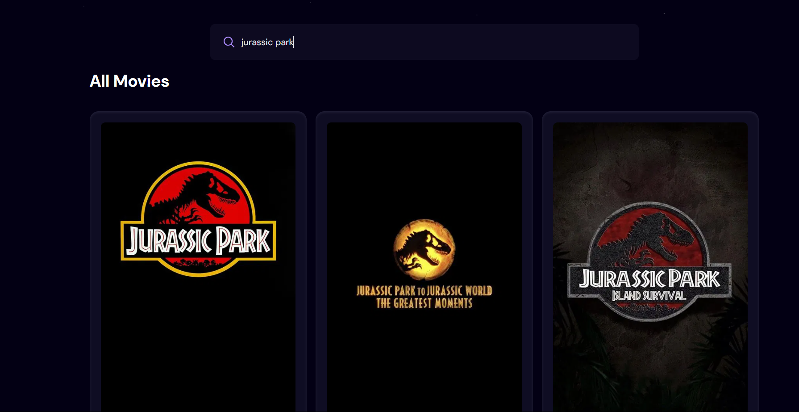
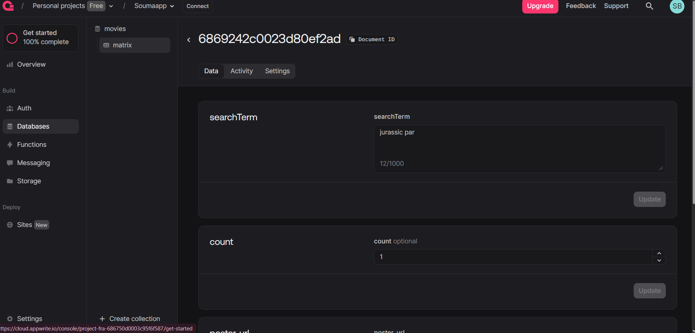
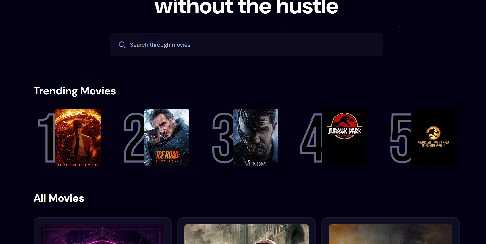

This is a web app designed by me with the help of React.js and Vite
It is called CineDine
#Description of the Project
In CineDine there are unlimited movies which I have got accesed with the help of API from. Then I have implemented Debounce function to optimise search option and reduce load on API of The Movie Database.
With the help of APPwrite we have also made a database to store the user's search.

 Here you can see when a user is trying to search Jurassic park it is shown in the data base.
Lastly we have also add a trending section where the movies you search often is shown.

